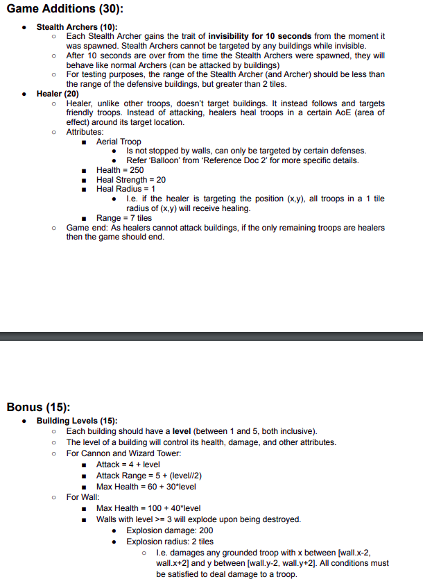

# Clash Of Clans Clone

- Apart from normal requirements:
    - King’s Leviathan Axe has also been implemented.
    - Dragon Character has been added, it can fly over walls.
    - Queen's Eagle Arrow has been added.
    - Movement avoiding walls has also been implemented.
    
- Added StealthArcher, Healer class to the given code.
- Wall explosion feature along with area of effect (aoe) damage added.
- Building levels randomly generated and attributes set in accord with the level.
 Functionalities </img>

- Open terminal and maximize the screen and also zoom out to view the game map in a better way.
- To run the game : `python3 game.py`
- To view replays : `python3 replay.py`  and select the replay you want to watch according to mentioned date and time.
- For Victory : All buildings apart from walls get destroyed from the map in all three levels.
- For Defeat : If all troops and King die before destroying all buildings apart from walls.

## Controls :

### Hero :

- w : move up
- a : move left
- d : move right
- s : move down
- 1 : Special Attack
- space : Normal Attack

### Barbarian :

- z : spawn at point 1
- x : spawn at point 2
- c : spawn at point 3

### Dragon :

- v : spawn at point 1
- b : spawn at point 2
- n : spawn at point 3

### Archer :

- i : spawn at point 1
- o : spawn at point 2
- p : spawn at point 3

### Balloon :

- j : spawn at point 1
- k : spawn at point 2
- l : spawn at point 3

### Stealth Archer : 

- u : spawn at point 1
- t : spawn at point 2
- y : spawn at point 3

### Healer:

- e : spawn at point 1
- f : spawn at point 2
- g : spawn at point 3

q : Quit Game

## Assumptions :

- Rage and Heal Spell can be applied multiple times.
- The limit for troops in each level is as follows :
    - Barbarians : 10
    - Archers : 7
    - Balloon : 5
    - Dragon : 3
- You have to choose the type of troop movement at start of the game.
- You have to choose the hero after each level.
- Each Stealth Archer gains the trait of invisibility for 10 seconds from the moment it was spawned. Stealth Archers cannot be targeted by any buildings while invisible.
- Healer, unlike other troops, doesn’t target buildings. It instead follows and targets friendly troops, It is an aerial troop. It deals AOE that is everyone in 1 radius of vicinity of someone who is being healed will also be healed.
- Healer cannot heal another healer.
- Healer follows/king only when there is atleast one troop fighting on the ground. That is if only King is spawned at bottom right corner and healer is spawned at top left corner, because since no troop present, healer won't move.
- Healer moves towards the nearest troop which is not at its max health.
- Building level displayed on top right tile of each building whose level had to be implemented like cannon and wizard tower.
- Level generated using ```random.randint(1,5)``` for cannon, wizard tower, wall.
- Wall level is implied from its colour using the follwing function:

```
    if wall_level == 5:
        return Back.CYAN
    elif wall_level == 4:
        return Back.YELLOW
    elif wall_level == 3:
        return Back.BLACK
    elif wall_level == 2:
        return Back.BLUE
    else:
        return Back.RED
```

- Wall with level >= 3 explode on being destroyed. Explosion damage: 200 , Explosion radius: 2 tiles
- Explosion affects all troops inside a 5*5 square with the point of the explosion/wall coordinate being the centre of the square.
- King is also damaged in case of wall explosion and all the nearby troops also.
- If spawn limit for all troops expired, and only healers remain on the ground, the game ends.
